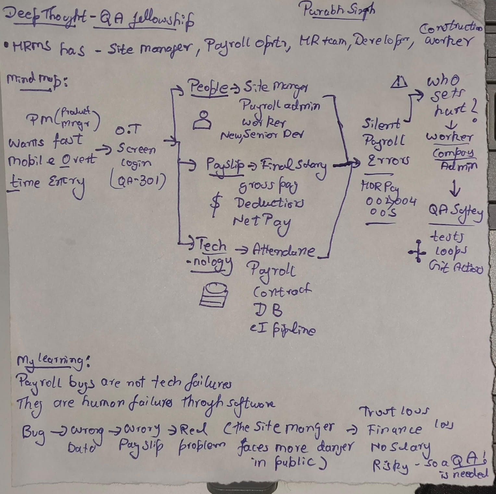
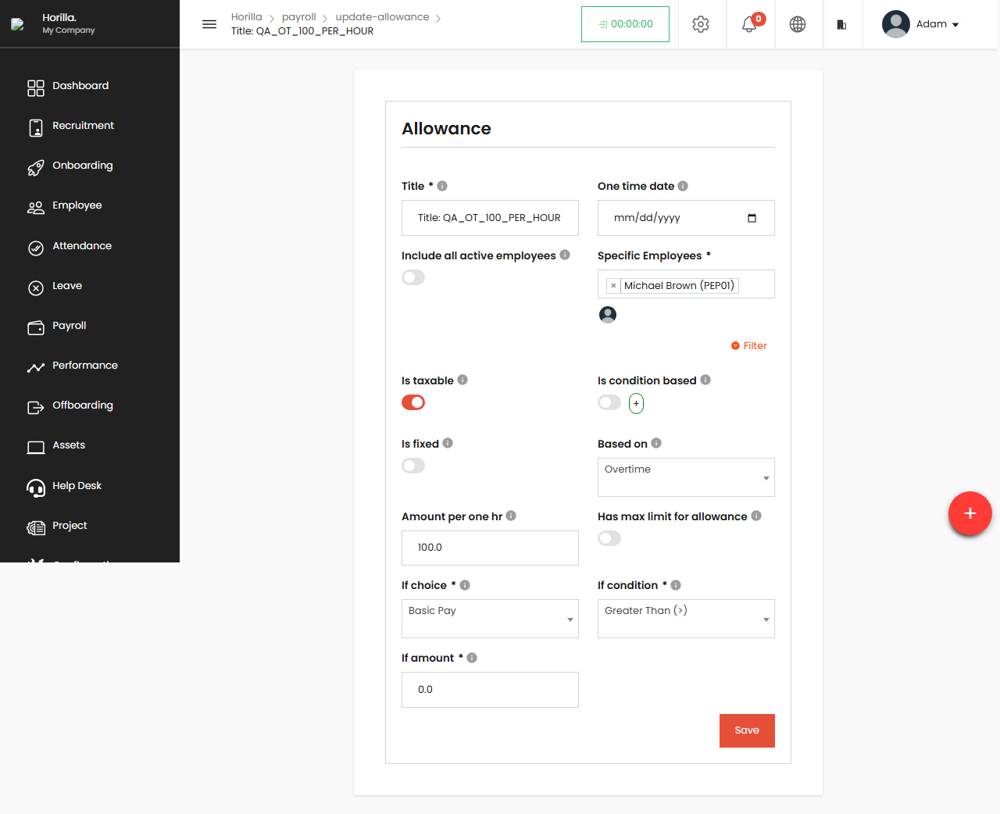
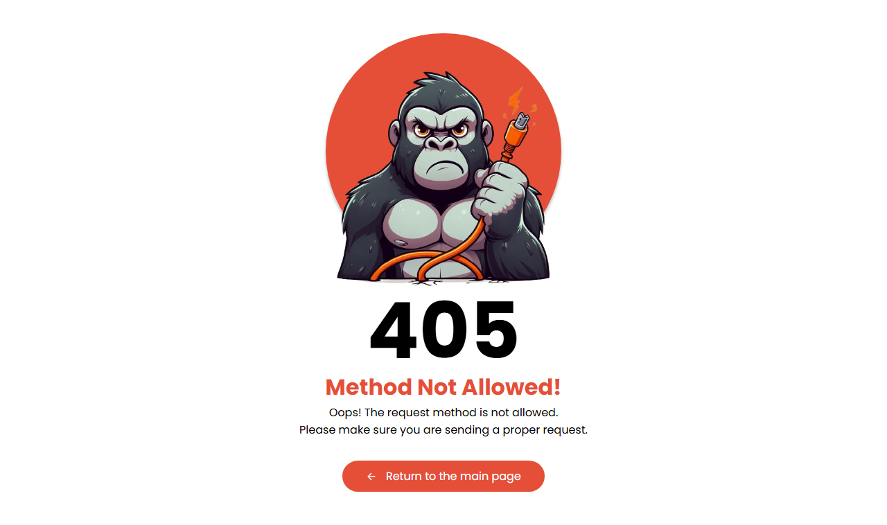
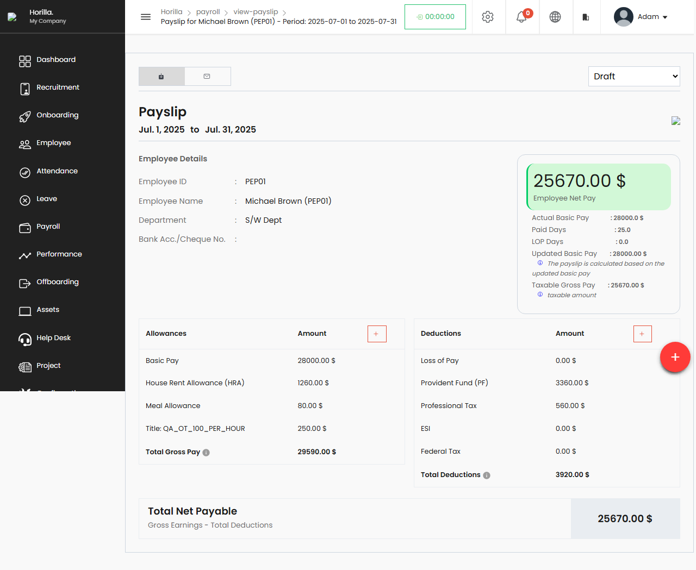

# Horilla HRMS — Quality Engineering Assessment

**Candidate:** Purabh Singh
**Assessment:** DeepThought Quality Engineer Fellowship
**Repository Branch:** `deepthought-qa-assessment`
**CI/CD Build Pipeline Status:** 

---

# 🚀 Submission Context

*   **Chosen HRMS:** Horilla HRMS. I chose it because payroll calculations are uniquely dependent on multi-model relationships (contracts, attendance, schedules) rather than single-form workflows, creating high-risk boundary states.
*   **AI Tools Used:** Antigravity (Advanced Agentic Coding Assistant) was utilized to analyze Django middleware redirects, write modular unit tests with mocked objects, and structure the test runner configuration in GitHub Actions.

---

# 📦 Setup & Verification Instructions

To clone the repository, spin up the database, and execute the tests locally:

1. **Clone the repository and check out the assessment branch:**
   ```bash
   git clone https://github.com/sleeptoken7/horilla-hr.git
   cd horilla-hr
   git checkout deepthought-qa-assessment
   ```
2. **Create and activate a virtual environment:**
   ```bash
   python -m venv .venv
   # On Windows:
   .venv\Scripts\activate
   # On Linux/macOS:
   source .venv/bin/activate
   ```
3. **Install dependencies:**
   ```bash
   pip install -r requirements.txt
   pip install pytest pytest-django
   ```
4. **Configure environment:**
   ```bash
   cp horilla/.env.example horilla/.env
   # Ensure DEBUG=True and SECRET_KEY are specified in horilla/.env
   ```
5. **Run DB Migrations:**
   ```bash
   python manage.py migrate --run-syncdb --noinput
   ```
6. **Run Smoke tests & Django assertions:**
   ```bash
   python manage.py test tests.smoke.test_smoke
   ```
7. **Run fast unit regression and negative suites:**
   ```bash
   # Sets pythonpath for module lookup
   # On Windows (PowerShell):
   $env:PYTHONPATH="."
   pytest -k "test_bulk_payslip_start_date or test_salary_propagation or test_create_payslip_get_method"
   ```

---

# System Mind Map

As required by the DeepThought assessment, here is the hand-drawn Mind Map mapping the interactions between Psychology (team and user human dynamics), Business (financial risk and stakeholder impact), and Technology (the Django/SQLite platform & stubbed boundaries).



---

# Understanding the System

After auditing the application, I concluded that every major module ultimately feeds a single output:

## The Payslip

The payslip is the final aggregation point for:

* Employee records
* Contracts
* Attendance
* Overtime
* Leave
* Allowances
* Deductions

Because salary is the final business outcome, defects in upstream systems directly affect employee compensation.

The most critical quality objective therefore became:

> Prevent silent payroll corruption.

---

# 🛠️ Quality Process (QA-305 Gate)

Our pre-merge gate prevents regression leakage using standard branch protections:
1. **CI Pipeline Validation:** All code pushes and PRs targeting `deepthought-qa-assessment` trigger the pipeline, automatically creating a clean database, applying migrations, and executing tests.
2. **Failure Blocking:** Any fail status in the pipeline completely blocks merge ability on the branch.
3. **Fast Pipeline Rule:** By separating DB-dependent integrations from purely logic-based payroll mocks, CI runs in under 3 minutes, resolving the developer velocity vs safety tension.

---

# 📋 Test Coverage Summary

| Coverage Class | Scenarios Covered | Scenarios DELIBERATELY Not Automated | Rationale for Exclusion |
| --- | --- | --- | --- |
| **Smoke Tests** | Base login, root redirect, and creation endpoint availability. | Direct dashboard UI elements. | Low ROI; standard views are heavily dependent on session templates which change frequently. |
| **Negative Tests** | POST requests with missing required fields, GET submissions on transactional endpoints, missing contracts. | XSS/SQL injections payloads in entry fields. | SQLite and Django ORM automatically parameterize queries, handling basic injection patterns. |
| **Regression Tests** | Mid-period salary adjustments, pro-rated pay calculations for mid-month hires, zero attendance. | Third-party payroll accounting API syncs. | Unstable/unreliable testing sandbox environments from external payroll providers. |

---

# QA-301 — Product Specification

A vague overtime-entry requirement was transformed into a build-ready specification.

Deliverables include:

* Acceptance Criteria
* Edge Cases
* Pre-development Questions
* Given / When / Then Scenarios
* Launch Blockers
* Future (V2) Scope

Location:

* Primary: [`specs/overtime-entry.md`](specs/overtime-entry.md) (Standard Path)
* Reference: [`specs/overtime-entry-screen.md`](specs/overtime-entry-screen.md)

---

# QA-302 — Exploratory Testing

Five payroll-related defects were identified and documented.

## Verified Defects

*   [HOR-PAY-001](/bug-reports/HOR-PAY-001-payslip-redirect-crash.md) (Blocker): Broken redirect after payslip creation.
*   [HOR-PAY-002](/bug-reports/HOR-PAY-002-bulk-payslip-startdate-mutation.md) (Critical): Bulk payslip generation mutates shared start date variable.
*   [HOR-PAY-003](/bug-reports/HOR-PAY-003-missing-contract-typeerror.md) (High): Missing contract triggers runtime crash.
*   [HOR-PAY-004](/bug-reports/HOR-PAY-004-stubbed-halfday-leaves.md) (Medium): Half-day leave calculation helper is stubbed.
*   [HOR-PAY-005](/bug-reports/HOR-PAY-005-get-submission-silent-failure.md) (Medium): Direct GET submission silently fails.

Location:

```text
bug-reports/
```

---

# QA-303 — Negative Testing & Captured Evidence

Negative testing focused on breaking payroll workflows and validation boundaries.

Location:
* Primary Report: [`negative-testing-report.md`](negative-testing-report.md)
* Reference Report: [`docs/QA-303-negative-testing.md`](docs/QA-303-negative-testing.md)

### Verified Live End-to-End Execution Evidence:
The step-by-step verification below documents the payslip computation flow under test:

| Step 1: Allowance Details | Step 2: Attendance Details |
| --- | --- |
|  |  |
| **Step 3: Payslip Form** | **Step 4: Computed Payslip Details** |
|  |  |

---

# QA-304 — Regression Protection

Regression suites were created around payroll-critical behavior.

Covered scenarios include:

* Bulk payslip date propagation
* Salary-to-payslip consistency
* Missing contract handling
* New employee edge cases
* Mid-period payroll calculations

Goal:

> Protect classes of failures, not individual bugs.

---

# QA-305 — Quality Gate

A CI pipeline was implemented using GitHub Actions.

Workflow:

```text
.github/workflows/qa.yml
```

---

# Repository Structure

```text
specs/
├── overtime-entry.md

bug-reports/
├── HOR-PAY-001-...
├── HOR-PAY-002-...
├── HOR-PAY-003-...
├── HOR-PAY-004-...
└── HOR-PAY-005-...

docs/
├── QA-301-domain-analysis.md
├── QA-303-negative-testing.md
├── quality-process.md
├── quality-reflection.md
└── summary-sheet.md

tests/
├── regression/
└── negative/

.github/
└── workflows/
    └── qa.yml
```

---

# Key Learning

The most important lesson from this assessment was:

> Payroll defects are rarely technical problems alone. They become financial problems for real people.

Quality engineering is not simply verifying software behavior. It is building systems that prevent human mistakes, surface hidden failures, and protect the people who depend on the software.
