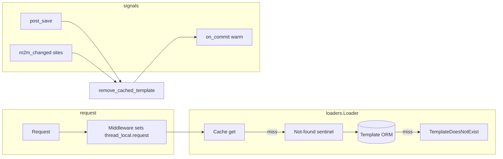

# `horilla_dbtemplate` — Database-backed Django templates

This app stores Django template source in the database, resolves it per **Site** (request host) and **language**, caches results, and falls back to filesystem/app templates when nothing matches. It is suited for white-label or multi-tenant UIs (e.g. overriding `login.html` per domain) without redeploying files.

Use this document when extending behaviour, debugging cache issues, or onboarding another agent to the codebase.

---

## Requirements and integration

| Requirement | Notes |
|-------------|------|
| **`django.contrib.sites`** | `Site` rows drive host → template scope. `sites` M2M on `Template` links overrides to one or more sites. |
| **`horilla.contrib.utils.middlewares`** | Loader reads `request` from `_thread_local`; ensure that middleware runs before template rendering where DB resolution is needed. |
| **`auditlog`** | `Template.history` uses `AuditlogHistoryField`. |
| **Template engine** | Register the custom loader (see below) **before** filesystem loaders if DB should win when both exist. |

### Django settings (reference)

- **`INSTALLED_APPS`**: include `django.contrib.sites` and `horilla_dbtemplate` (or the app’s dotted path your project uses).
- **`HORILLA_DBTEMPLATE_CACHE_BACKEND`**: optional; name of a key in `CACHES` (default: `"default"`). See `conf.py`.
- **`HORILLA_DBTEMPLATE_AUTO_POPULATE_CONTENT`**: optional; if true, empty content can be filled from disk on save. See `conf.py`.

### Registering the loader

Add the loader class to the Django template engine’s `OPTIONS["loaders"]`. The import path is typically:

`horilla_dbtemplate.loaders.Loader`

Place it according to product rules: usually **first among custom loaders** so active DB templates override packaged files. Exact `TEMPLATES` structure depends on your Horilla project; search the repo for `Loader` or `horilla_dbtemplate.loaders`.

---

## High-level behaviour

1. **Site resolution** (`utils/site.py`): from the current request host (and optionally `X-Forwarded-Host` / port), find a `Site` whose `domain` matches. If none match, resolved site is **`None`** → loader will not use site-scoped DB rows for that request; only global DB rows and then other loaders apply.
2. **Loader** (`loaders.py`): tries **cache** → **“not found” sentinel** → DB queries (site-specific then global, language-specific then language-agnostic) → raises `TemplateDoesNotExist` so the engine tries the next loader (e.g. filesystem).
3. **Serving rules**: only **`state=active`** templates are returned; `active_from` / `active_until` must include “now” (`is_schedulable_active`).
4. **Cache** (`utils/cache.py`): keys are `horilla_dbtemplate::<slugified_name>::<site_pk|global>::<slugified_lang>`. Invalidation must cover **all locale variants** in `LANGUAGES` plus `LANGUAGE_CODE`, because the loader uses `get_language()` while many rows use blank `language`.
5. **Signals** (`signals.py`): on **`post_save`** and **`m2m_changed`** (`Template.sites`), caches are cleared immediately; **warming** runs inside **`transaction.on_commit`** so M2M matches the DB after admin `ModelForm` saves.

---

## Package layout and file roles

Paths are relative to **`horilla_dbtemplate/`**.

| Path | Role |
|------|------|
| **`__init__.py`** | Package docstring summarising resolution order and localhost / non-matching-site behaviour. |
| **`apps.py`** | `HorillaDBTemplateConfig` (`AppLauncher`): app label, verbose name, **`auto_import_modules = ["signals"]`** so receivers load at startup. |
| **`models.py`** | **`Template`**: name, content, state, sites M2M, language, tags, schedule, lock fields, analytics, audit history; **`TemplateVersion`**: immutable snapshots; helpers `get_template_source`, `populate`, lock/unlock, `clean` / `save` with versioning. |
| **`admin.py`** | `ModelAdmin` / inlines: change form, version history, diff, preview, unlock URLs, edit lock on change view, bulk actions (activate, archive, cache invalidate/repopulate, syntax check, export JSON). Uses `add_template_to_cache` / `remove_cached_template` where appropriate. |
| **`signals.py`** | Connects **`post_save`**, **`pre_delete`**, **`m2m_changed`** on `Template.sites`: invalidate wide, then **`on_commit`** refresh cache for the saved row’s **current** sites/languages. |
| **`loaders.py`** | Django **`BaseLoader`** subclass: thread-local request, site + language, cache layer, DB query order, analytics update on successful DB read, `TemplateDoesNotExist` fallback. |
| **`conf.py`** | `HORILLA_DBTEMPLATE_*` settings → cache backend name, `AUTO_POPULATE_CONTENT`, **`get_cache()`**. |
| **`utils/cache.py`** | Cache key helpers, **`remove_cached_template`** (all sites × all request languages), **`warm_template_cache`**, **`add_template_to_cache`**, `set_and_return` for loader; optional `request_finished` → **`cache.close`** for locmem-style backends. |
| **`utils/site.py`** | **`get_request_host`**, **`get_site_for_request`** (proxy-aware). |
| **`utils/template.py`** | **`check_template_syntax`** for admin bulk action. |
| **`utils/__init__.py`** | Package marker for utilities. |
| **`migrations/`** | Schema for `Template`, `TemplateVersion`, M2M; keep in sync with models. |
| **`templates/admin/horilla_dbtemplate/template/*.html`** | Admin UI: **`restore_version.html`**, **`diff.html`**, **`preview.html`**. |

---

## Model reference (concise)

### `Template`

- **`name`**: logical path like `login.html` (must align with `` / `get_template()` names).
- **`content`**: Django template source.
- **`state`**: `draft` / `active` / `archived` — **only `active`** is served by `Loader`.
- **`sites`**: empty = **global** (applies when global queries match); non-empty = restricted to those site PKs when request host resolved to that site.
- **`language`**: optional; empty means “all languages” for DB matching; still affects **cache warming** keys (see `_iter_warm_languages_for_instance` in `utils/cache.py`).
- **Scheduling**: `active_from`, `active_until`.
- **Locking**: `locked_by`, `locked_at` (admin acquires lock on change view).
- **Analytics**: `access_count`, `last_accessed_at` (updated when served from DB).

### `TemplateVersion`

- Snapshot per save when content/state changes; used for restore + diff in admin. Unique on `(template, version)`.

---

## Cache contract (important for changes)

- **Key shape**: `horilla_dbtemplate::{slugify(template_name)}::{site_id|global}::{slugify(language_or_all)}`.
- **Why many languages on delete**: Loader uses `get_language()` (e.g. `en`), not only the model’s `language` field. Invalidation iterates **`_iter_request_language_codes()`** so stale `::en` keys are cleared when `language` on the row is blank.
- **Warming**: After invalidation, **`warm_template_cache`** repopulates keys for the template’s **current** `sites` only (or global keys if no sites). **Double `on_commit`**: saving in admin can schedule two warms; both should be idempotent (re-set same keys).

If you add a new dimension to cache keys (e.g. theme), extend **`get_cache_key`**, **`remove_cached_template`**, and the loader in one pass.

---

## Admin and custom URLs

Registered on **`TemplateAdmin`** (see `admin.py`):

- Restore version: `.../restore/<version>/`
- Diff: `.../diff/`
- Preview: `.../preview/`
- Force unlock: `.../unlock/`

Bulk actions call **`add_template_to_cache`** / **`remove_cached_template`** from `utils/cache.py`.

---

## Pitfalls for contributors / AI agents

1. **`post_save` fires before M2M write** on standard `ModelForm`: never warm cache synchronously on `post_save` using only in-memory `instance.sites` — signals use **`transaction.on_commit`** for warming.
2. **Removing a site from M2M**: must clear keys for **that site PK** for all languages; `remove_cached_template` deletes for **every** `Site` × every language variant — do not narrow that without fixing stale-key bugs.
3. **Host must match a `Site`**: site-specific DB rows are only used when `get_site_for_request` returns a site; otherwise resolution uses **global** DB rows only, then filesystem.
4. **Archived / draft**: loader filters `state=STATE_ACTIVE` only.
5. **`pre_delete`**: connected to **`remove_cached_template`** only (no warm). Deleting a row should not re-insert cache.

---

## Related reading in-repo

- **`models.py`** docstring at top: compatibility notes and feature list.
- **`loaders.py`** module docstring: resolution order and analytics.
- **`utils/site.py`** docstring: proxy / `X-Forwarded-Host` behaviour.

When opening a PR or handing off to another model, mention any change to **cache key format**, **signal wiring**, or **loader ordering** — those affect production caching and multi-tenant correctness.
